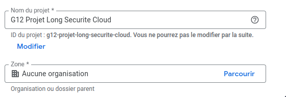
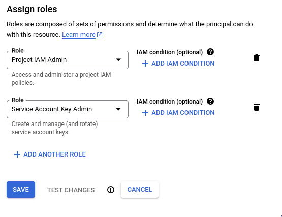
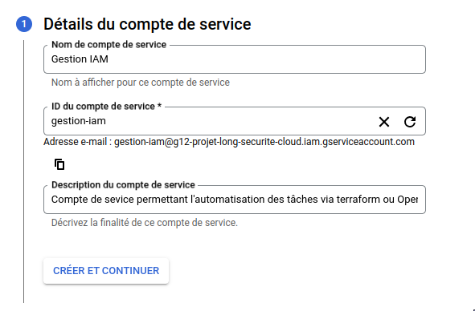

# Practical application

## Objective

Our goal is to create a standard cloud infrastructure, and leverage our
understanding to highlight and exploit the vulnerabilities we would have
left behind.

## Setting up authorisations

We start by creating a google cloud project :

{width="5.833333333333333in"
height="1.9895833333333333in"}

We proceed to the IAM section to create a service account for managing
the IAM policies.

  --------------------------------------------------------------------------------------------------------
  {width="3.7857141294838144in"   {width="3.658241469816273in"
  height="2.4843755468066493in"}                       height="2.6093755468066493in"}
  ---------------------------------------------------- ---------------------------------------------------

  --------------------------------------------------------------------------------------------------------

Once the service account is created we can export its credentials file,
which will be the key to automating all the remaining configuration with
IaC.

All the configuration is referenced under in this repo :
[[https://github.com/Aitbytes/Projet-Long-Infra/]{.underline}](https://github.com/Aitbytes/Projet-Long-Infra/)

The first step consists in creating a separate service account, then
providing it with the necessary roles for further deployments tasks. The
script used for that end is referenced under :
[[https://github.com/Aitbytes/Projet-Long-Infra/tree/main/PrepareAccounts]{.underline}](https://github.com/Aitbytes/Projet-Long-Infra/tree/main/PrepareAccounts)

Simultaneously it provides each team mate with the identical rôles.

The roles granted to both the service account and the teammates are :

-   **Cloud Run Admin**

-   **Cloud Run Invoker**

-   **Compute Admin**

-   **Kubernetes Engine Admin**

-   **Storage Admin.**
